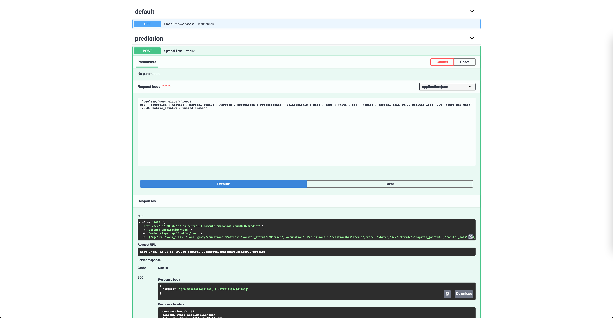

# Esercizi sessione numero 2: MLOps su AWS

Qui di seguito gli esercizi preparati per la seconda sessione del corso.

## 1. Set up AWS CLI

Una volta installato [AWS CLI (v2)](https://docs.aws.amazon.com/cli/latest/userguide/install-cliv2.html), eseguire da riga di comando
```sh
aws configure
```
specificando la propria Access key, la Secret Access key e la regione (*eu-central-1*). Default output format puo' essere *None*.

Testare che la CLI sia configurata correttamente tramite il seguente comando. 
```sh
aws iam get-user
```

## 2. Operazioni su buckets S3 via Boto3
Installare boto3 via pip (*pip install boto3*). Eseguire il seguente script in Python per importarlo e controllare in quale regione si sta lavorando
```python
import boto3

session = boto3.session.Session()
current_region = session.region_name
print(current_region)
```
Usiamo boto3 per scaricare un paio di file necessari per i prossimi esercizi
```python
import boto3

s3_resource = boto3.resource('s3')
s3_resource.Object('layerfiles-mlops-course', 'layer_file.zip').download_file('./layer.zip')
s3_resource.Object('layerfiles-mlops-course', 'model.onnx').download_file('./model.onnx')
s3_resource.Object('layerfiles-mlops-course', 'mlflow_model.zip').download_file('./mlflow_model.zip')
s3_resource.Object('layerfiles-mlops-course', 'input_batch.csv').download_file('./input_batch.csv')
```
Per creare un bucket
```python
s3_resource.create_bucket(Bucket='nome-bucket', CreateBucketConfiguration={'LocationConstraint': 'eu-central-1'})
```
Per fare l'upload di un file in un determinato bucket usare
```python
s3_resource.Object(bucket_name='nome_bucket', key='input_batch.csv').upload_file('./input_batch.csv')
```

##3. Creazione di un servizio che effettui batch predictions tramite AWS lambda

In questo esercizio useremo il servizio AWS Lambda per far partire un batch predict ogni qualvolta un dataset venga uploadato in uno specifico bucket. 
I risultati del batch predict verranno uploadati in un bucket separato

### step 1: Creazione buckets
Creiamo 3 buckets vuoti direttamente (da console, da linea di comando o tramite boto3). I bucket creati devono essere settati in modo bloccare tutti gli accessi pubblici (opzione di default).

Un bucket sara' usato per il modello serializzato, uno sara' il bucket per il batch di dati input e uno per gli output.
Usiamo la seguente nomenclature. 

 * Bucket modello: 'model-nomeservizio'
 * Bucket modello: 'input-nomeservizio' 
 * Bucket modello: 'output-nomeservizio'

Dove nomeservizio e' il nome che volete dare al servizio (fate in modo che sia univoco).

Aggiungiamo infine il file model.onnx scaricato durante l'esercizio 2 nel bucket per il modello.

### step 2: Creazione Policies and Roles
Andiamo su Servizi IAM e clicchiamo su Policy --> Crea Policy. Una volta aperto l'editor clicchiamo il tab JSON e copiamo il seguente contenuto

```json
{
    "Version": "2012-10-17",
    "Statement": [
        {
            "Effect": "Allow",
            "Action": [
                "logs:PutLogEvents",
                "logs:CreateLogGroup",
                "logs:CreateLogStream"
            ],
            "Resource": "arn:aws:logs:*:*:*"
        },
        {
            "Effect": "Allow",
            "Action": [
                "s3:GetObject"
            ],
            "Resource": "arn:aws:s3:::input-bucket-nomeservizio/*"
        },
        {
            "Effect": "Allow",
            "Action": [
                "s3:GetObject"
            ],
            "Resource": "arn:aws:s3:::model-nomeservizio/*"
        },
        {
            "Effect": "Allow",
            "Action": [
                "s3:PutObject"
            ],
            "Resource": "arn:aws:s3:::output-bucket-nomeservizio/*"
        }
    ]
}
```
Premurandoci di sostituire i nomi dei bucket con quelli che abbiamo creato prima. 
Nella pagina verifica policy specifichiamo il nome 'batch-lambda-nomeservizio-policy' come nome e clicchiamo su crea policy.

Nella pagina principale IAM clicchiamo infine su ruoli--> Crea nuovo. Scegliamo Lambda dai casi d'uso disponibili e colleghiamo la policy creata sopra, 'batch-lambda-nomeservizio-policy'.

Chiamiamo il Ruolo 'batch-lambda-nomeservizio-role' e clicchiamo sul tasto crea.

### step 3: Creazione di una Lambda function

Andiamo su servizi --> Lambda e clicchiamo su crea funzione. 
Utilizziamo l'opzione usa un piano (use a blueprint) e scegliamo s3-get-object-python, cliccando su configura.

Nelle informazioni di base scegliamo il nome 'batch-lambda-nomeservizio' specificando di usare un ruolo esistente scegliendo 'batch-lambda-nomeservizio-role'. 
La funzione lambda e' adesso autorizzata ad accere ai buckets creati per l'esercizio. 

Sotto trigger S3 selezionia,p il bucket creato prima 'input-bucket-nomeservizio'.

Clicchiamo su crea funzione.

### step 4: Creazione di un Lambda layer
Torniamo su Servizi-Lambda e clicchiamo su 'Livelli' (layers) --> Crea livello. 
Nella pagina di creazione usa 'batch-runtime-nomeservizio' come nome, e carichiamo un file come zip scegliendo il file layer.zip scaricato prima. 

Clicchiamo su crea dopo aver scelto come runtime compatibile Python 3.7.

In servizi--> Lambda clicchiamo sulla funzione creata, scrolliamo in basso e sotto la voce livelli clicchiamo su aggiungi livello. 

Scegliamo livelli personalizzati e nel menu a tendina cerchiamo  'batch-runtime-nomeservizio'. Clicchiamo su aggiungi.

### step 5: Scrittura funzione
Nella pagina della funzione Lambda andiamo su configurazione, sotto la voce configurazione generale. Andiamo ad editare la memoria dedicata alla funzione, portandola a 256MB e aumentiamo il Timeout a 10 secondi.

Sostituitiamo quindi la funzione lamdba.py con le seguenti righe di codice
```python
import urllib.parse
import boto3
import pandas as pd
import onnxruntime as rt
from io import StringIO


print('Loading function')

s3 = boto3.client('s3')
s3_resource = boto3.resource('s3')
csv_buffer = StringIO()


def process_inputs(x):
    x['age']=x['age'].astype(int)
    x['hours_per_week']=x['hours_per_week'].astype(int)
    x['capital_gain']=x['capital_gain'].astype(int)
    x['capital_loss']=x['capital_loss'].astype(int)
    inputs = {c: x[c].values for c in x.columns}
        
    for k in inputs:
        inputs[k] = inputs[k].reshape((inputs[k].shape[0], 1))

    return inputs


def lambda_handler(event, context):
    #print("Received event: " + json.dumps(event, indent=2))

    # Get the object from the event and show its content type
    bucket = event['Records'][0]['s3']['bucket']['name']
    key = urllib.parse.unquote_plus(event['Records'][0]['s3']['object']['key'], encoding='utf-8')
    print(bucket, key)
    
    try:
        response = s3.get_object(Bucket=bucket, Key=key)
        x = pd.read_csv(response['Body'])
        print("CONTENT TYPE: " + response['ContentType'])
        s3_resource.Object('model-nomeservizio', 'model.onnx').download_file('/tmp/model.onnx')
        sess = rt.InferenceSession('/tmp/model.onnx')
        
        onnx_outputs = sess.run(None, process_inputs(x))
        pd.DataFrame(onnx_outputs[1]).to_csv(csv_buffer)
        s3_resource.Object(bucket_name='model-nomeservizio', key='predictions.csv').put(Body=csv_buffer.getvalue())        
        
        return response['ContentType']
    except Exception as e:
        print(e)
        print('Error while performing lambda task')
        raise e
```
Cambiamo i nomi dei bucket per il modello e per l'output e clicchiamo su Deploy.

### step 6: Test della funzione
Tramite console o boto3 carichiamo il file batch_input.csv scaricato per l'esercizio 1 all'interno del bucket 'input-bucket-nomeservizio'. Attendiamo che venga creato il file predictions.csv nel bucket 'output-bucket-nomeservizio'.

Sulla pagina della funzione possiamo cliccare sul tasto monitora per controllare il log di esecuzione tramite CloudWatch.

### step 7: Esercizio facoltativo
Fai si che il file creato nel bucket in output contenga anche il dataframe di input (usando ad esempio pandas.concat([input,output]) e che all'interno del nome del file salvato ci sia anche un timestamp.

## 4. Deploy di un endpoint /predict su AWS EC2
La cartella _/fastapi_ec2_ contiene tutto il codice necessario per questo esercizio, in particolare é presente un'applicazione  sviluppata con FastAPI e containerizzata con Docker, che espone un endpoint per effettuare predizioni (utilizzando un modello già allenato e _impacchettato_ con ClearBox Wrapper).

Gli step da seguire per effettuare il deploy di questa applicazione su EC2 sono:

1. Accedere alla propria console su AWS e selezionare "Avvia una macchina virtuale"
2. Selezionare **Ubuntu Server 20.04 LTS** come immagine base per la propria istanza e proseguire

1. Come tipo di istanza andremo ad utilizzare una _t2.large_
2. Avanzare nelle schermate successive fino a quella relativa alla configurazione dei gruppi di sicurezza. Qui specificare una nuova regola in ingresso, in modo da permettere la ricezione di richieste custom TCP dall'esterno sulla porta 8000 della nostra macchina virtuale. L'altra regola abilitata di default (SSH sulla porta 22) ci permetterà invece di accedere da remoto alla nostra istanza

5. A questo punto cliccare su _Analizza e avvia_ e in seguito su _Lancio_. Creare quindi una nuova coppia di chiavi con un nome da voi scelto, salvandola sul propio computer. A questo punto selezionando _Avvia le istanze_ avremo una nostra macchina virtuale su EC2
6. Dalla schermata _Istanze_ (<https://eu-central-1.console.aws.amazon.com/ec2/v2/home?region=eu-central-1#Instances:>) si potrà vedere l'istanza appena creata con lo stato _In esecuzione_. Accedendo all'istanza e navigando nella sezione _Reti_ avrete a disposizione l'indirizzo IPv4 Pubblico della macchina, copiatelo perché verrà usato per accedere da remoto alla stessa.
7. Aprite il terminale sul vostro PC e posizionatevi nella cartella dove avete precedentemente salvato la coppia di chiavi. Da qui assegnate permessi di esecuzione al file _.pem_ delle chiavi, usando il comando `chmod 400 nome_file_chiavi.pem`
8. Ora potrete accedere tramite SSH alla vostra macchina in remoto, usando il comando `ssh -i nome_file_chiavi.pem ubuntu@IPv4_pubblico`
9.  Una volta effettuato l'accesso si potrà installare Docker sull'istanza, usando i comandi:
```
sudo apt-get update
sudo apt install docker.io
```
e lanciarlo con:
```
sudo service docker start
```
10. Per controllare che Docker sia stato installato correttamente potete lanciare il comando `sudo docker version`
11. Ora non basterà che trasferire la cartella con l'applicazione sull'istanza EC2, buildarla usando Docker e infine lanciare le APIs. Per prima cosa bisogna copiare e incollare la cartella con l'applicazione da lanciare dove si trova la coppia di chiavi di AWS. Quindi basterà usare da terminale il comando:
```
scp -i nome_file_chiavi.pem -r ./fastapi_ec2 ubuntu@IPv4_pubblico:/home/ubuntu/app
```
per trasferire l'applicazione in remoto.
12. Arrivati a questo punto potremo procedere con il lancio del container Docker. Ricollegandoci in SSH all'istanza EC2 e navigando nella cartella _/home/ubuntu/app_, bisognerà eseguire i seguenti comandi per avviare il container con la nostra applicazione FastAPI:
```
sudo docker build -t mymodel .
sudo docker run --name myapp -p 8000:8000 mymodel conda run --no-capture-output -n wrapper_launcher uvicorn main:app --host 0.0.0.0 --port 8000
```
13. Accedendo da browser all'indirizzo pubblico della nostra istanza sulla porta 8000 al path /docs si potrà, infine, visitare la documentazione della nostra applicazione e provare il modello deployato


Per testare il funzionamento del modello copiare e incollare il seguente json nell'apposito campo all'interno di /docs
```json
{"age":39,"work_class":"Local-gov","education":"Masters","marital_status":"Married","occupation":"Professional","relationship":"Wife","race":"White","sex":"Female","capital_gain":0.0,"capital_loss":0.0,"hours_per_week":28.0,"native_country":"United-States"}
```

## 5. Deploy di un endpoint su SageMaker tramite mlflow
mlflow offre la possibilita' di fare un deploy dei modelli salvati nel loro formato su infrastruttura AWS tramite SageMaker.
Il deploy di un modello richiede il push di un'immagine mlflow sull'Elastic Container Registry (ECR). Questa operazione va effettuata una tantum tramite linea di comando
```sh
mlflow sagemaker build-and-push-container
```
E' sufficience avere nel registro ECR una sola immagine per organizzazione. Una volta effettuato il push di tale immagine e' possibile fare il deploy di un nuovo modello tramite il seguente script
```python
import mlflow.sagemaker as mfs

region = "eu-central-1" # region of your account
model_uri = "./mlflow_model/"
image_ecr_url = '#id.dkr.ecr.eu-central-1.amazonaws.com/mlflow-pyfunc:1.15.0' #Inserire indirizzo ARN dell'immagine su ECR
app_name = "income-prediction"
arn_role = 'arn:aws:iam::088093517335:role/service-role/AmazonSageMaker-ExecutionRole-20210425T181732' #Esempio: inserire l'ARN dell'execution role autorizzato ad usare SageMaker
mfs.deploy(app_name=app_name, execution_role_arn= arn_role, model_uri=model_uri, image_url=image_ecr_url, region_name=region, mode="create")
```
E' possibile usare il modello mlflow scaricato durante l'esercizio 1. Una volta effettuato il deploy l'endpoint dovrebbe comparire anche nella console di SageMaker.
L'endpoint e' raggiungibile tramite boto3 utilizzando lo script seguente.
```python
import pandas as pd
import boto3
import json

def check_status(app_name):
    sage_client = boto3.client('sagemaker', region_name="eu-central-1")
    endpoint_description = sage_client.describe_endpoint(EndpointName=app_name)
    endpoint_status = endpoint_description["EndpointStatus"]
    return endpoint_status

def query_endpoint(app_name, input_json):
    client = boto3.session.Session().client("sagemaker-runtime", region)

    response = client.invoke_endpoint(
        EndpointName=app_name,
        Body=input_json,
        ContentType='application/json; format=pandas-split',
    )
    preds = response['Body'].read().decode("ascii")
    preds = json.loads(preds)
    print("Received response: {}".format(preds))
    return preds
region = "eu-central-1"
app_name = "income-prediction"

print("Application status is: {}".format(check_status(app_name)))

X= pd.read_csv('./adult_batch.csv')
query_input = pd.DataFrame(X).iloc[[3]].to_json(orient="split")
prediction1 = query_endpoint(app_name=app_name, input_json=query_input)
```


