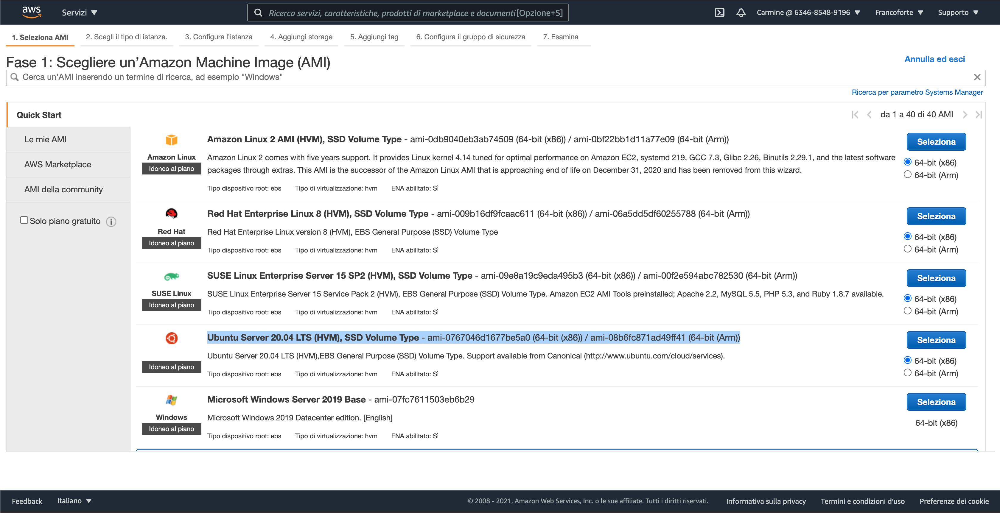
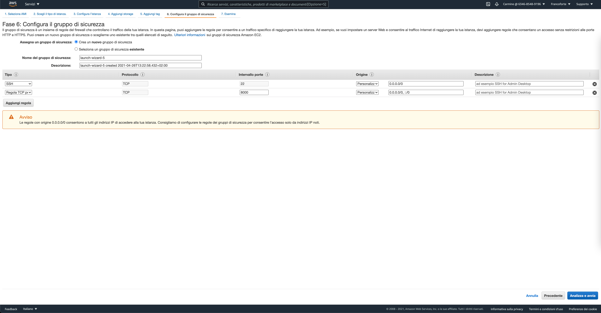
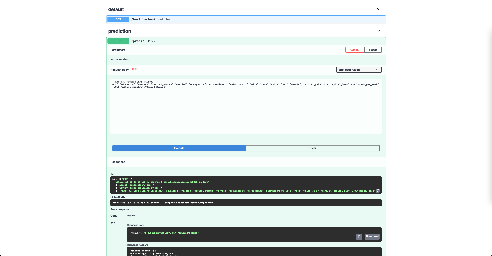

# Sessione 1: Esercizi pratici

## Passaggi preliminari
Entra nella directory del repository e crea un nuovo virtual env. 
```sh
$python3 -m venv ./venv_corso
$source ./venv_corso/bin/activate                        (Linux)
$.\venv_corso\Scripts\activate.bat                 (Windows cmd)
```
Installa i requirements del repository e i pacchetti locali.
```sh
$pip install -r requirements.txt
$pip install -e .
```
Allena il classificatore 'giocattolo' incluso nel repository, aggiungilo ai file versionati
```sh
$python ./model/model_training.py
$git add ./model.pkl
$git commit -m 'aggiunto modello'
$git push
```

## Creazione di un test
Il file *test/test_data_and_model.py* contiene un esempio di test scritto con pytest. Per far girare questi test in locale usa il comando
```sh
$python -m pytest
```
Ad ogni esecuzione pytest colleziona e fa girare tutte le funzioni contenenti 'test' nel nome.

Prova a scrivere un altro test che importi il modello serializzato e:
* Controlli che il classificatore non sia un 'majority classfifier', ovvero che sia in grado di classificare piu' di un etichetta sul test set
* Controlli che la precisione e la sensitivita' (recall) del modello siano sopra una certa soglia da te scelta.
<details> 
  <summary>Possibile soluzione</summary>

    def test_model_metrics(adult_test_dataset):
        x, y, data_path = adult_test_dataset
        clf = joblib.load('./model.pkl')
        predictions = clf.predict(x)
        metrics = classification_report(y, predictions, output_dict=True)
    
        assert len(np.unique(predictions)) > 1
        assert metrics['>50K']['precision'] > 0.7 #fill here
        assert metrics['>50K']['recall'] > 0.1 #fill here
</details>

## Creazione di una GitHub Action
Crea una cartella chiamata '.github' all'interno della directory principale. All'interno di questa cartella crea una cartella chiamata 'workflows'.

In quest'ultima crea un file 'CI.yaml' e copia/incolla il seguente codice
```yaml

name: Test

on: [push]

jobs:
    build:
        runs-on: ubuntu-latest
        strategy:
            matrix:
                python-version: [3.7, 3.8]

        steps:
        - uses: actions/checkout@v2

        - name: Set up Python ${{ matrix.python-version }}
          uses: actions/setup-python@v2
          with:
            python-version: ${{ matrix.python-version }}

        - name: Install dependencies
          run: |
            python -m pip install --upgrade pip
            pip install -r requirements.txt
            pip install -e .

        - name: Pytest
          run: |
            pytest -v --maxfail=3 --cache-clear
```
Effettua un commit e un push e segui la action direttamente su GitHub (repository --> tab 'actions')

## Grid-search di iperparametri con mlflow
Modifica lo script ./experiments/run_grid_search.py cambiando lo spazio di ricerca (aggiungendo/togliendo iperparametri e possibili valori).
Una volta arricchito la spazio di ricerca fai girare lo script  
```sh
$python experiments/run_grid_search
```
Quale combinazione di iperparametri ha dato l'F1 piu' alto? Fai girare il seguendo comando nella shell
```sh
$mlflow ui
```
Per visualizzare gli esperimenti effettuati fino ad ora puoi collegarti via browser all'indizzo (localhost:5000). 
La barra 'search runs' permette di effettuare ricerche tra i vari esperimenti usando un linquaggio di query semplificato. Es:
```
metrics.precision > 0.6 and params.depth='3'
```
## Serving di un modello con FastAPI
La cartella /app contiene un esempio di utilizzo di FastAPI per il serving di un modello. FastAPI permette di creare app usando relativamente poche righe di codice come si puo' apprezzare in main.py.

Per fare partire l'app entra nella cartella app e usa il comando
```sh
$uvicorn main:app
```
L'API dovrebbe essere servita localmente alla porta 8000. L'indirizzo (localhost:8000/docs) contiene un sommario degli endopoint disponibili e permette di effettuare query di prova.

Prova a effettuare il setup di FastAPI per un modello da te selezionato. Questo richiede di cambiare, oltre al path che collega il modello serializzato, la funzione predict e la classe
```python
class InputExample(BaseModel):
```

## Deploy di un endpoint /predict su AWS EC2
La cartella _/fastapi_ec2_ contiene tutto il codice necessario per questo esercizio, in particolare é presente un'applicazione 
sviluppata con FastAPI e containerizzata con Docker, che espone un endpoint per effettuare predizioni (utilizzando un modello già allenato e _impacchettato_ con ClearBox Wrapper).

Gli step da seguire per effettuare il deploy di questa applicazione su EC2 sono:

1. Accedere alla propria console su AWS e selezionare "Avvia una macchina virtuale"
2. Selezionare **Ubuntu Server 20.04 LTS** come immagine base per la propria istanza e proseguire

1. Come tipo di istanza andremo ad utilizzare una _t2.large_
2. Avanzare nelle schermate successive fino a quella relativa alla configurazione dei gruppi di sicurezza. Qui specificare una nuova regola in ingresso, in modo da permettere la ricezione di richieste custom TCP dall'esterno sulla porta 8000 della nostra macchina virtuale. L'altra regola abilitata di default (SSH sulla porta 22) ci permetterà invece di accedere da remoto alla nostra istanza

5. A questo punto cliccare su _Analizza e avvia_ e in seguito su _Lancio_. Creare quindi una nuova coppia di chiavi con un nome da voi scelto, salvandola sul propio computer. A questo punto selezionando _Avvia le istanze_ avremo una nostra macchina virtuale su EC2
6. Dalla schermata _Istanze_ (<https://eu-central-1.console.aws.amazon.com/ec2/v2/home?region=eu-central-1#Instances:>) si potrà vedere l'istanza appena creata con lo stato _In esecuzione_. Accedendo all'istanza e navigando nella sezione _Reti_ avrete a disposizione l'indirizzo IPv4 Pubblico della macchina, copiatelo perché verrà usato per accedere da remoto alla stessa.
7. Aprite il terminale sul vostro PC e posizionatevi nella cartella dove avete precedentemente salvato la coppia di chiavi. Da qui assegnate permessi di esecuzione al file _.pem_ delle chiavi, usando il comando `chmod 400 nome_file_chiavi.pem`
8. Ora potrete accedere tramite SSH alla vostra macchina in remoto, usando il comando `ssh -i nome_file_chiavi.pem ubuntu@IPv4_pubblico`
9.  Una volta effettuato l'accesso si potrà installare Docker sull'istanza, usando i comandi:
```
sudo apt-get update
sudo apt install docker.io
```
e lanciarlo con:
```
sudo service docker start

```
10. Per controllare che Docker sia stato installato correttamente potete lanciare il comando `sudo docker version`
11. Ora non basterà che trasferire la cartella con l'applicazione sull'istanza EC2, buildarla usando Docker e infine lanciare le APIs. Per prima cosa bisogna copiare e incollare la cartella con l'applicazione da lanciare dove si trova la coppia di chiavi di AWS. Quindi basterà usare da terminale il comando:
```
scp -i nome_file_chiavi.pem -r ./hello.txt ubuntu@IPv4_pubblico:/home/ubuntu/app
```
per trasferire l'applicazione in remoto.
12. Arrivati a questo punto potremo procedere con il lancio del container Docker. Ricollegandoci in SSH all'istanza EC2 e navigando nella cartella _/home/ubuntu/app_, bisognerà eseguire i seguenti comandi per avviare il container con la nostra applicazione FastAPI:
```
sudo docker build -t mymodel .
sudo docker run --name myapp -p 8000:8000 mymodel conda run --no-capture-output -n wrapper_launcher uvicorn main:app --host 0.0.0.0 --port 8000
```
13. Accedendo da browser all'indirizzo pubblico della nostra istanza sulla porta 8000 al path /docs si potrà, infine, visitare la documentazione della nostra applicazione e provare il modello deployato
